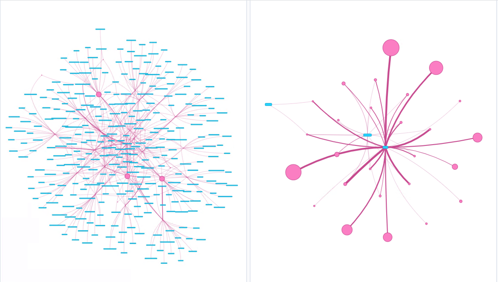

# resthttpck suite

## Intro
Main idea is to build a set of cli's that can be used to test part of our infrastructure supporting services we are offereing. 
Two have been built up so far: Sorenson and Vidyo. To get an understanding of what can it be achieved do:

```
python http_tester.py --help
usage: http_tester.py [-h] --c CLASSTEST --t WHICHTEST [--n NUMBEROFJOBS]

Once you are in your container running Python 3.6, in order to test Sorenson do:

Sorenson:

- Submit jobs for transcoding where you can indicate if you want to use multiple e.g. false or single e.g. true

Example: transcoding_job_true_algo  it's a single job and title is 'algo'. --n indicates how many you want to send.

    $python http_tester.py --c Sorenson --t transcoding_job_true_algo --n 1

- Query for jobs submitted in less than X hours: e.g. query_job_1 in less than one hour

$python http_tester.py --c sorenson --t query_job_1

Vidyo:

- Print the WSDL definition file in use, see config file.

Example:
    $python http_tester.py --c vidyo --t PrintWSDLdefinition

- Create a public room:

Example: where first parameter (:True) indicates if it's locked, second if it has PIN or not and,
 third if it has moderator PIN. PIN will be generated randomly.

    $python http_tester.py --c vidyo --t CreatePublicRoom:True:True:True

- Change Room profile: profile can just be 'NoAudioAndVideo' or empty one. In the latter the profile is reset. RoomID is
the first parmeter.
Example:
    $python http_tester.py --c vidyo --t ToggleRoomProfile:85589:NoAudioAndVideo

- Get Room profile
Example:
    $python http_tester.py --c vidyo --t GetRoomProfile:85593

- Update room: you indicate the extension (due to Vidyo API) and the new owner (It must already exist)
Example:
$python http_tester.py --c vidyo --t UpdateRoomOwner:109991939:XXXXXX

optional arguments:
  -h, --help        show this help message and exit
  --c CLASSTEST     Sorenson test
  --t WHICHTEST     type of job to be sent e.g. Sorenson:transcoding
  --n NUMBEROFJOBS  how many of whichtest jobs to be sent
  
  ```

## Install

Do:
```
git clone https://github.com/CERNCDAIC/resthttpck.git
cd resthttpck
# in case not have installed
pip install virtualenv   
virtualenv -p python3 ./venv
source .venv/bin/activate
# prepare the project
pip install requirements.txt 
python setup.py develop
```
## Configuration

Configuration files are expected to be located at:
- For the logging: '/etc/resthttpck/logging.conf'
- For the resthttpck.ini: '/etc/resthttpck/resthttpck.ini'

Folder for logs and files located at '/var/log/resthttpck' and '/var/log/resthttpck/files'

ini example:
```
[sorenson]
url=https://domain/api/jobs/
presetids=ed4133a6-dfcb-407e-89d2-5a74d23961bb,9d301467-3f22-41ea-add5-9bf829be6e1c,e87ae9f2-ceab-412e-a5e7-5c180f156762
queueid=4d725f86-f9d2-4d55-93e9-6acbe44a0e1d
username01=CERN\\\\XXXXX
password01=x654BUSQpHcw
masterfiles=CERN-VIDEO-2006-014-001.avi
masterfiles_path=//cern.ch/dfs/Scratch/master
fileuritest=//cern.ch/dfs/Scratch/test
fileuritestwild=//cern.ch/dfs/Scratch/test/%%SOURCE%%_%%JOBID%%_%%PRESET%%
mysql_user=read_only_guy
mysql_host=XXXXX
mysql_port=XXXX
mysql_db=
mysql_password=XXXX
mysql_charset=utf-8
[vidyo]
user_wsdl=https://domain/services/v1_1/VidyoPortalUserService?wsdl
admin_wsdl=https://domain/services/v1_1/VidyoPortalAdminService?wsdl
username=XXXXXX
password=XXXXX
owner=webcast
mysql_db=db_host:db_port:user:password:db:utf8
[general]
tempfiles=/var/log/resthttpck/files
jobidfiles=/var/log/resthttpck/files/jobids
```

## Kubernetes cluster for online data collection from Vidyo

Basically a pod with two containers has been configured. On container fetches the data from Vidyo MySQL CDR database and writes every record on a file. A second container reads that file and sends it to logstash for ingestion into Elasticsearch. The file is located on a shared between both containers CEPH volume.

[CERN Kubernetes infrastructure](https://clouddocs.web.cern.ch/containers/README.html) (authentication required) has been used. 

```
--create image
docker build -f Dockerfile .
docker build -t gitlab-registry.cern.ch/collaborativeapps/resthttpck .
docker push gitlab-registry.cern.ch/collaborativeapps/resthttpck

--setup environment
$ eval $(ai-rc "IT project")
$ . ./env_zoom-av.sh
--further setup omitted 
$ kubectl apply -f avstats.yml
```

This leads to some dahsboards in Kibana e.g. network representation of which meetings and which routers/gateways are in used (thicker lines imply higher utilization):

